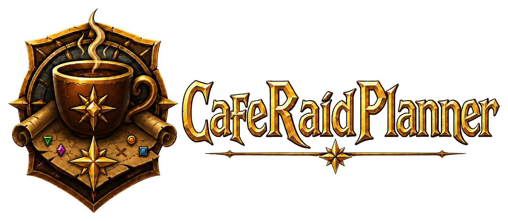
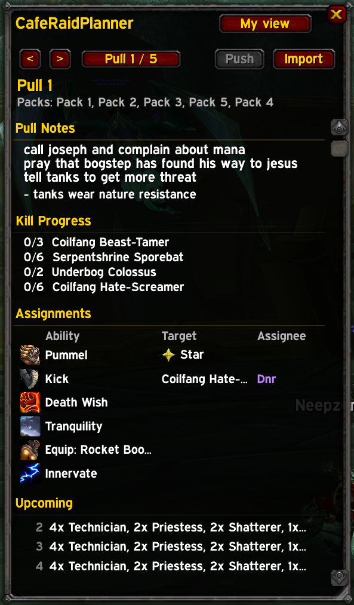
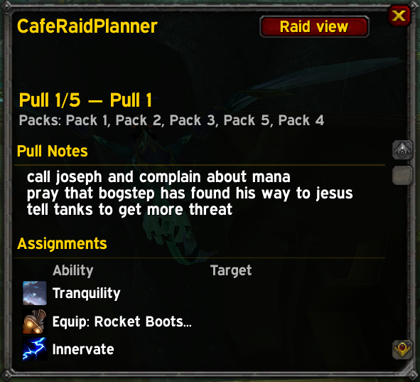
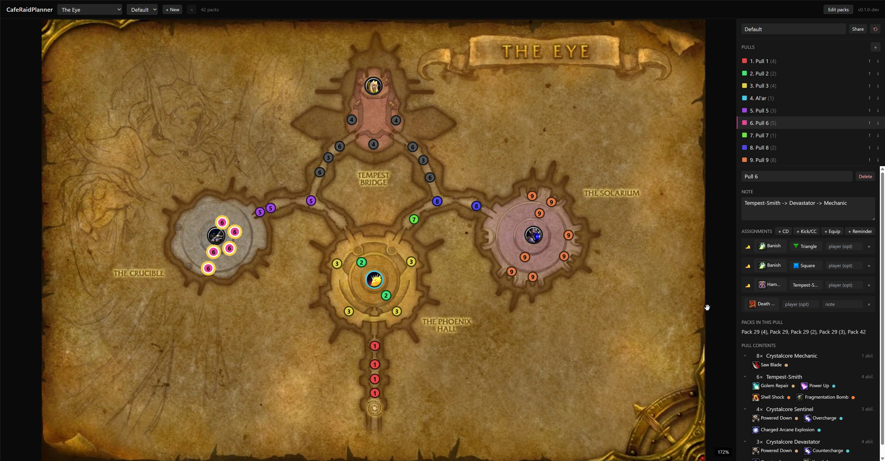

# CafeRaidPlanner

A WoW Classic addon for running planned raid pulls. You build the plan in
the [web planner](https://cafewow.github.io/CafeRaidPlanner-Web/), paste the
share string into the addon, and the rest of the raid sees pull-by-pull what
they're supposed to do.

It hooks the combat log to track kills, auto-advances through the pull list
as packs die, and shows each player only what's relevant to them.

Tested on Classic Era / Anniversary; should load anywhere that accepts a BCC
TOC (`Interface 20504`).

## Install

Easiest way is [CurseForge](https://www.curseforge.com/wow/addons) — search
for "CafeRaidPlanner". Or grab a release zip from this repo and drop the
`CafeRaidPlanner` folder into your AddOns directory.

## What you get

For the raid leader, the full window:

- Pull notes and reminders straight from the plan
- Live kill progress per mob, with auto-advance when the pull is done
- All assignments laid out as a table — cooldowns, kicks/CC, equip swaps
- Preview of the next few pulls

For everyone else, the same plan filtered down to their character:

Only assignments addressed to you show up. Spells and CC are filtered by
what your class actually knows, so a warrior doesn't see Polymorph and a
rogue doesn't see Innervate. Toggle with the **My view** / **Raid view**
button in the top-right corner. The window remembers its size and position
separately per mode.

## Using it

1. Build a plan on the [web planner](https://cafewow.github.io/CafeRaidPlanner-Web/),
   hit Share, copy the `crp1.…` string.
2. In-game, type `/crp import` and paste it in.
3. Open the window with `/crp` (or it'll pop open when you zone into a raid).
4. As raid leader, hit **Push** in the addon to broadcast the plan + current
   pull index to everyone else in the raid. They'll get a prompt to import.

The current pull advances on its own as packs die. If you go off-script
(skipped a pull, came back to redo one) you can jump to any pull from the
counter dropdown — the tracker fills in or clears intermediate kill state
accordingly, so the numbers stay consistent with where you actually are.

Kill progress survives a `/reload` mid-raid. A new lockout (after a reset
and zone back in) wipes everything on the next kill.

## Where the plans come from

Plans are built in the [web planner](https://cafewow.github.io/CafeRaidPlanner-Web/) —
drop pack markers on the raid map, group them into pulls, assign cooldowns
and CCs, then export a share string. The addon imports that string.

## Slash commands

| Command | What it does |
|---|---|
| `/crp` | toggle the window |
| `/crp import` | open the paste-string dialog |
| `/crp next` / `/crp prev` | navigate pulls manually |
| `/crp my` / `/crp raid` | switch view mode |
| `/crp push` | broadcast plan + current pull to the raid |
| `/crp auto on\|off` | combat-log auto-advance (default on) |
| `/crp autoshow on\|off` | open window on raid zone-in / incoming plan (default on) |
| `/crp autoimport on\|off` | skip the import prompt for pushed plans (default off) |
| `/crp clearkills` | reset tracked kills without dropping the plan |
| `/crp reset` | drop the plan entirely |
| `/crp debug on\|off` | log each UNIT_DIED GUID, for lockout troubleshooting |

## Related

- Web planner: [cafewow/CafeRaidPlanner-Web](https://github.com/cafewow/CafeRaidPlanner-Web)
- Architecture notes and dev docs: `PROJECT.md` in the repo root
